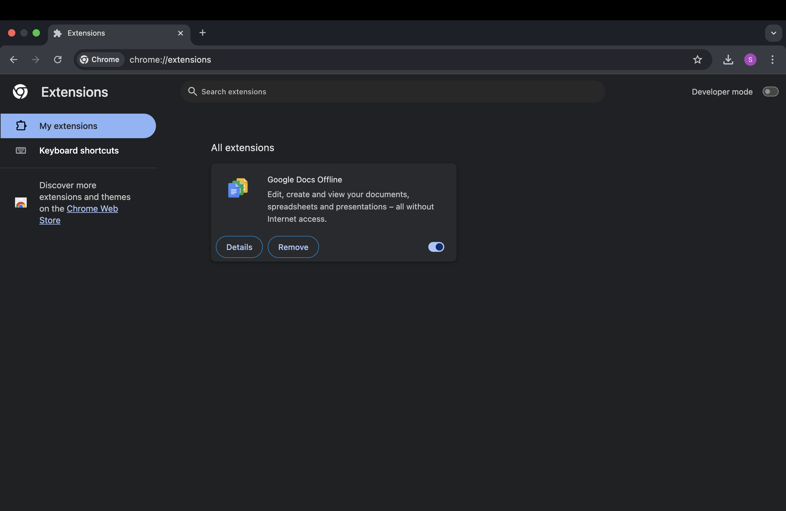

# Task 7: Identify and Remove Suspicious Browser Extensions

## Objective
To understand how to identify potentially harmful browser extensions, review their permissions, and remove unnecessary or suspicious ones to improve security and performance.

## Tools Used
- Google Chrome (Version: [Your Version])
- Built-in Chrome Extensions Manager (`chrome://extensions/`)
- Chrome Web Store for reviewing extension ratings and publisher information

## Steps Performed
1. **Opened Extensions Manager**  
   Navigated to `chrome://extensions/` in Google Chrome.
   
2. **Reviewed Installed Extensions**  
   Checked all extensions for:
   - Publisher name
   - Description and purpose
   - Permissions granted
   - User reviews and ratings from the Chrome Web Store

3. **Identified Safe and Suspicious Extensions**  
   - Only **Google Docs Offline** was installed.
   - Verified as safe because it is developed by Google LLC and only requests necessary permissions to work offline.

4. **Decision on Removal or Keeping**  
   - No suspicious extensions found.
   - No removals were needed.
   
5. **Restarted Browser**  
   Restarted Chrome to ensure no background processes from extensions remained.

6. **Researched Malicious Extension Risks**  
   Learned about potential threats such as:
   - Data theft
   - Ad injection
   - Redirecting traffic to malicious sites
   - Performance degradation

---

## Findings
| Extension Name      | Publisher  | Reason for Keeping/Removal         | Action Taken |
|---------------------|------------|-------------------------------------|--------------|
| Google Docs Offline | Google LLC | Official Google extension; safe     | Kept         |

---

## How Malicious Extensions Can Harm Users
- **Stealing Credentials:** Extensions with access to forms or keylogging abilities can capture usernames and passwords.
- **Tracking Browsing Activity:** Collecting and selling personal browsing history.
- **Injecting Malicious Content:** Inserting ads, pop-ups, or phishing content into legitimate sites.
- **Redirecting Search Queries:** Sending users to unsafe or scam websites.
- **Installing Malware:** Downloading harmful files without the user's consent.

---

## Best Practices for Safe Extension Usage
1. Install only from official extension stores (Chrome Web Store, Firefox Add-ons).
2. Review permissions carefully before installing.
3. Check extension publisher and verify authenticity.
4. Read recent reviews to identify potential issues.
5. Regularly audit installed extensions and remove unused ones.
6. Keep extensions updated through official update channels.
7. Avoid sideloading extensions from unknown sources.

---

## Outcome
- Learned to evaluate browser extensions for security and necessity.
- Developed awareness of potential threats from malicious extensions.
- Gained practical skills to manage and remove extensions safely.

---

## Screenshot

